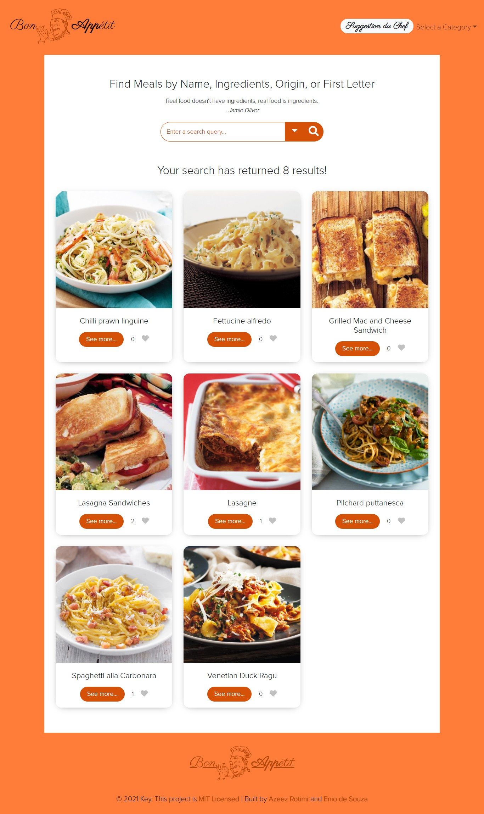

<p align="center">
  <a href="https://www.microverse.org/">
    
  </a>
  <a href="https://github.com/enionsouza/BonAppetit">
    
  </a>
  <a href="https://github.com/enionsouza/BonAppetit">
    
  </a>
</p>


# Bon Appétit

## About

This web app was built as the Capstone Project for Microverse JavaScript Curriculum Module.
It was built upon two independent APIs:
- [Meal DB](https://www.themealdb.com/api.php): data about meals
- [Involvement](https://www.notion.so/microverse/Involvement-API-869e60b5ad104603aa6db59e08150270): Microverse API to record the different user interactions (likes, comments).

Below a screenshot of the homepage is presented.

<p align="center">
    
</p>

## Built With

- HTML, CSS, JavaScript;
- Jest, & Webpack;
- VisualStudio Code, Git, & GitHub;

## Pre-requisites

- NodeJs (v. 14.17)
- Git

## Live Demo

A live demo for this project can be found in [this link](https://enionsouza.github.io/BonAppetit/dist/).

## Getting Started

To run this project, you only need a computer with a browser installed, and follow these steps:


1. In your terminal, in the folder of your preference, type the following bash command to clone this repository:

```sh
git clone git@github.com:enionsouza/BonAppetit.git
```

2. Now that you have already cloned the repo run the following commands to get the project up and running:
```sh
cd BonAppetit
npm install
npm start
```


### Tests

We have implemented tests for itemsCounter() and commentsCounter() methods in `/src/spec` folder. You can run them using the following command:

```sh
npm test
```

Additionally, you can run `npm run watch-test` to watch any new test modification as you save them.


## Author

👤 **Azeez Rotimi Arigbabuwo**

- Github: [@rotimiazeez](https://github.com/rotimiazeez)
- Twitter: [@harzeyzh](https://twitter.com/Harzeyzh)
- Linkedin: [@azeezrotimi019](https://www.linkedin.com/in/azeezrotimi019/)

👤 **Ênio Neves de Souza**

- GitHub: [@enionsouza](https://github.com/enionsouza)
- Twitter: [@enionsouza](https://twitter.com/enionsouza)
- LinkedIn: [Enio Neves de Souza](https://www.linkedin.com/in/enio-neves-de-souza/)

## 🤝 Contributing

Contributions, issues, and feature requests are welcome!

Feel free to check the [issues page](https://github.com/enionsouza/BonAppetit/issues).

## Show your support

Give a ⭐️ if you like this project!

## 📝 License

This project is [MIT](./LICENSE) licensed.
